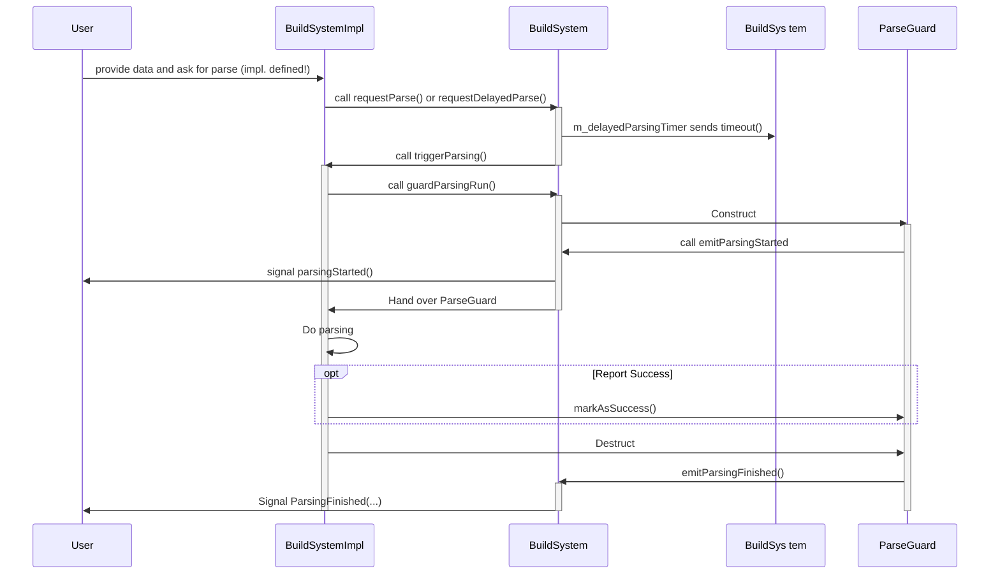
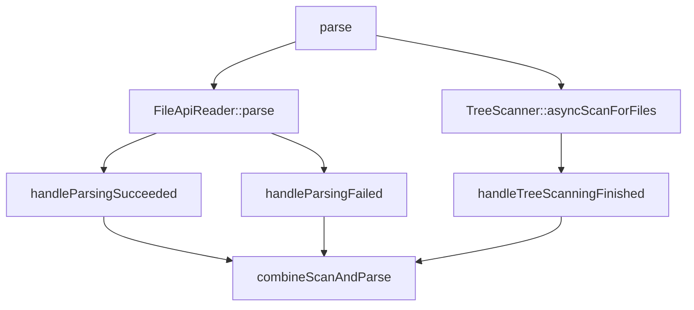
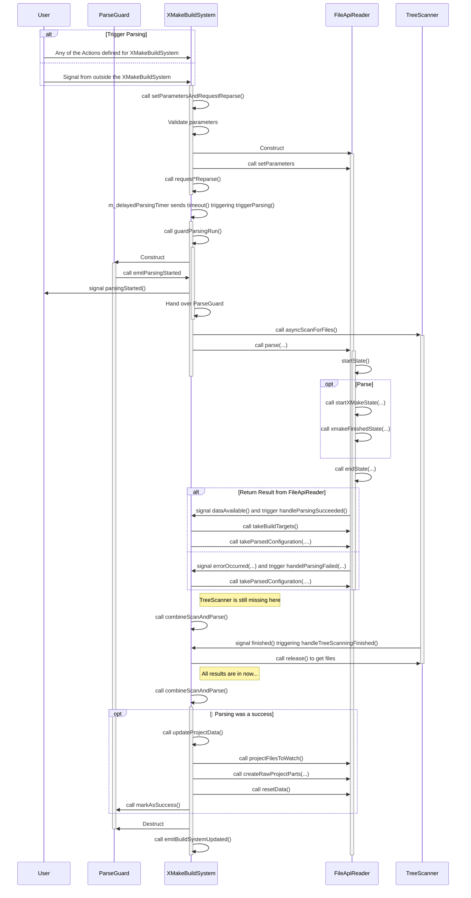
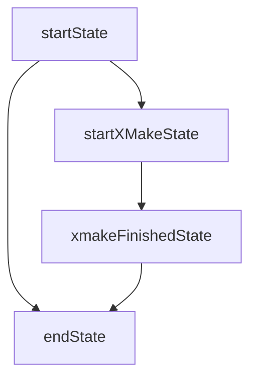

# `XMakeBuildSystem`

## Big Picture: `BuildSystem`

This is a sequence diagram of how `ProjectExplorer::BuildSystem` interacts with
its implementations:

## The Details of `XMakeBuildSystem`

### States Overview

### Full Sequence Diagram

# `FileApiReader`

States in the `FileApiReader`.

